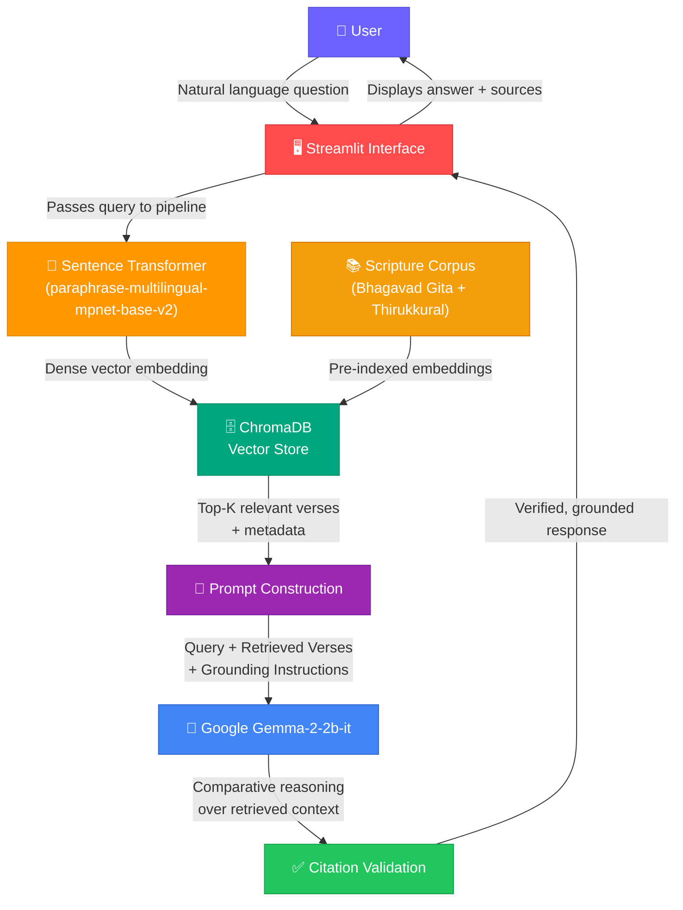

<div align="center">

# 🕉️ VerseSage
### *AI-Powered Cross-Scripture Wisdom Engine*
**Ask life's deepest questions. Receive grounded, citation-backed wisdom from India's sacred scriptures.**

<br/>

[](https://ai.google.dev/gemma)
[](https://python.org)
[](https://streamlit.io)
[](https://www.trychroma.com/)
[](LICENSE)

<br/>

[](#-rag-pipeline-explanation)
[](https://www.sbert.net/)
[](https://huggingface.co/)
[](https://pytorch.org/)

<br/>

VerseSage leverages **Retrieval-Augmented Generation (RAG)** and **Google Gemma-2-2b-it** to semantically search across the **Bhagavad Gita** and **Thirukkural**, delivering trustworthy, grounded, and comparative insights with full citation validation. Every response is anchored to authentic scripture — never hallucinated from model memory.

<br/>

[Key Features](#-key-features) · [Architecture](#%EF%B8%8F-architecture-overview) · [Get Started](#%EF%B8%8F-installation-guide) · [RAG Pipeline](#-rag-pipeline-explanation) · [Future Scope](#-future-scope)

</div>

---

## 📖 Problem Statement

India's scriptural heritage spans millennia of accumulated wisdom — teachings on duty, consciousness, ethics, compassion, and the nature of reality. Yet in the digital age, accessing and meaningfully comparing this knowledge remains a significant challenge.

| # | Barrier | Impact |
|---|---------|--------|
| **1** | **Keyword-only search** — Existing tools rely on exact word matches | Conceptual and paraphrased queries are missed entirely; cross-language semantic meaning is invisible |
| **2** | **No cross-scripture comparison** — Comparing themes across texts requires deep domain expertise | Learners, educators, and researchers must manually cross-reference thousands of verses |
| **3** | **AI hallucination risk** — General-purpose LLMs fabricate plausible but unsourced spiritual content | Users cannot trust or verify AI-generated answers, undermining credibility and respectfulness |
| **4** | **Fragmented access** — Each scripture lives in its own silo with its own tools and formats | A unified, intelligent interface across traditions simply does not exist |

> [!IMPORTANT]
> When dealing with sacred texts, **inaccuracy is not an option**. VerseSage addresses all four barriers through a unified RAG pipeline that retrieves before it reasons and cites before it claims.

---

## 💡 Solution Overview

VerseSage is an end-to-end **Retrieval-Augmented Generation (RAG)** system that transforms natural-language questions into citation-backed, cross-scripture responses.

Instead of relying on an LLM's training memory — which can hallucinate, fabricate verses, or misattribute quotes — VerseSage **retrieves authentic scripture passages first**, then instructs the model to reason exclusively over retrieved content. Every claim in the response is anchored to a real verse that the user can independently verify.

**Currently supported scriptures:**

| Scripture | Language | Verses | Description |
|-----------|----------|--------|-------------|
| **Bhagavad Gita** | Sanskrit | 700 verses | Dialogue between Arjuna and Lord Krishna exploring duty, righteousness, devotion, and the nature of the self |
| **Thirukkural** | Tamil | 1,330 couplets | Authored by Thiruvalluvar, organized into three books: Virtue (*Aram*), Wealth (*Porul*), and Love (*Inbam*) |

> [!NOTE]
> Support for additional Indian scriptures (such as the Upanishads, Dhammapada, Guru Granth Sahib, and Ramayana) is planned as future work. The current implementation **exclusively** covers **Bhagavad Gita** and **Thirukkural**.

---

## ✨ Key Features

| Feature | Description |
|---------|-------------|
| 🗣️ **Natural Language Questioning** | Ask questions in plain language — no special syntax, keywords, or scriptural knowledge required |
| 🧠 **Retrieval-Augmented Generation** | Grounds every response in retrieved scripture passages, preventing hallucination and fabrication |
| ⚖️ **Comparative Analysis** | Compares teachings across Bhagavad Gita and Thirukkural, surfacing shared wisdom and unique perspectives |
| 📜 **Citation Validation** | Every claim includes source scripture and verse reference for full verifiability |
| 🗄️ **ChromaDB Semantic Retrieval** | High-performance vector database delivers semantically relevant verses using cosine similarity |
| 🖥️ **Streamlit Interface** | Clean, interactive web UI accessible from any browser — no setup required for end users |
| 🔒 **Grounded Responses** | The model generates answers using **only** retrieved passages — never from training memory alone |

---

## 🏗️ Architecture Overview

The following diagram illustrates VerseSage's end-to-end RAG architecture — from user query to citation-validated response:



---

## 🔄 Project Workflow

The complete pipeline from user question to verified answer:

| Stage | Component | What Happens |
|-------|-----------|--------------|
| **1** | **User Input** | The user types a natural-language question (e.g., *"What is karma according to the Bhagavad Gita?"*) into the Streamlit interface |
| **2** | **Query Embedding** | The question is encoded into a dense vector using `paraphrase-multilingual-mpnet-base-v2`, capturing semantic meaning rather than surface-level keywords |
| **3** | **Semantic Retrieval** | ChromaDB performs cosine similarity search against pre-indexed verse embeddings from Bhagavad Gita and Thirukkural, returning the Top-K most relevant passages with metadata |
| **4** | **Prompt Construction** | A structured prompt is assembled containing the original question, retrieved verses with source citations, and explicit instructions for grounded comparative reasoning |
| **5** | **LLM Generation** | Google Gemma-2-2b-it processes the prompt and generates a comparative analysis, reasoning exclusively over the retrieved scripture passages |
| **6** | **Citation Validation** | The response is checked to ensure claims reference specific retrieved verses, maintaining traceability and trustworthiness |
| **7** | **Response Display** | The citation-backed answer and source references are displayed in the Streamlit interface for the user to read and verify |

---

## 🛠️ Technology Stack

| Layer | Technology | Role |
|-------|------------|------|
| **Language** | [Python](https://python.org) | Core application logic, pipeline orchestration, and data processing |
| **Frontend** | [Streamlit](https://streamlit.io) | Interactive web interface for natural-language question answering |
| **LLM** | [Google Gemma-2-2b-it](https://ai.google.dev/gemma) | Comparative reasoning, synthesis, and grounded response generation |
| **Embeddings** | [Sentence Transformers](https://www.sbert.net/) | Encodes queries and documents into dense semantic vectors (`paraphrase-multilingual-mpnet-base-v2`) |
| **Vector Database** | [ChromaDB](https://www.trychroma.com/) | Persistent storage and high-speed semantic retrieval of verse embeddings |
| **ML Framework** | [PyTorch](https://pytorch.org/) | Backend engine for model inference and tensor computation |
| **Transformers** | [Hugging Face Transformers](https://huggingface.co/docs/transformers) | Model loading, tokenization, and inference pipeline for Gemma-2-2b-it |
| **Data Source** | [KaggleHub](https://www.kaggle.com/) | Scripture dataset acquisition and management |

---

<details>
<summary><h2>📁 Folder Structure</h2></summary>

```
verse-sage/
├── app.py                     # Main entry point — launches Streamlit UI and orchestrates the RAG pipeline
├── data/                      # Raw and preprocessed scripture text corpora
│   ├── bhagavad_gita/         # Bhagavad Gita verses and metadata
│   └── thirukkural/           # Thirukkural couplets and metadata
├── embeddings/                # Embedding model configurations and cached vector representations
├── vectordb/                  # ChromaDB persistent storage for verse vector collections
├── pipeline/                  # RAG orchestration: embed → retrieve → generate
├── assets/                    # Images, logos, diagrams, and visual assets
│   └── screenshots/           # Application screenshots for documentation
├── requirements.txt           # Python dependency manifest
├── LICENSE                    # MIT License
└── README.md                  # Project documentation (this file)
```

| Directory / File | Purpose |
|------------------|---------|
| `app.py` | Application entry point; initializes the Streamlit interface and connects all pipeline stages |
| `data/` | Stores scripture files (Bhagavad Gita and Thirukkural) in structured formats ready for embedding |
| `embeddings/` | Contains embedding model configurations and pre-computed vector caches |
| `vectordb/` | Houses ChromaDB collections with persistent verse embeddings and metadata |
| `pipeline/` | Orchestrates the full RAG workflow — from query embedding through retrieval to response generation |
| `requirements.txt` | Declares all Python dependencies for reproducible installs |

</details>

---

<details>
<summary><h2>⚙️ Installation Guide</h2></summary>

### Prerequisites
- **Python** 3.10 or higher
- **Git**
- **pip**
- A machine with sufficient memory for Gemma-2-2b-it model inference (GPU recommended)

### Step 1 — Clone the Repository
```bash
git clone https://github.com/roshanisingh16/verse-sage.git
cd verse-sage
```

### Step 2 — Create a Virtual Environment
```bash
python -m venv venv
```
Activate it:
```bash
# Linux / macOS
source venv/bin/activate
# Windows
venv\Scripts\activate
```

### Step 3 — Install Dependencies
```bash
pip install -r requirements.txt
```

> [!TIP]
> If you have a CUDA-capable GPU, install the GPU version of PyTorch for significantly faster inference. See the [PyTorch installation guide](https://pytorch.org/get-started/locally/).

### Step 4 — Download Scripture Data
Ensure the scripture datasets (Bhagavad Gita and Thirukkural) are placed in the `data/` directory. KaggleHub is used for dataset acquisition — refer to the project's data loading scripts for details.

</details>

---

## 🚀 Running the Project
```bash
streamlit run app.py
```
The Streamlit interface will launch at **`http://localhost:8501`**. Open this URL in your browser to begin exploring cross-scripture wisdom.

> [!TIP]
> Ensure your virtual environment is activated and all dependencies are installed before running. On first launch, the embedding model and Gemma-2-2b-it weights may need to download, which requires an internet connection.

---

## 💬 Example Usage

### Sample Questions

| Question | What It Explores |
|----------|-----------------|
| *"What is karma according to the Bhagavad Gita?"* | Single-scripture deep dive into a foundational concept |
| *"What does Thirukkural teach about kindness?"* | Thirukkural's perspective on a universal virtue |
| *"Compare duty in Bhagavad Gita and Thirukkural"* | Cross-scripture comparative analysis of dharma and duty |
| *"How do Bhagavad Gita and Thirukkural define leadership?"* | Leadership ideals across two traditions |
| *"What is selfless action in Bhagavad Gita?"* | Nishkama karma — action without attachment to results |
| *"Compare the teachings on discipline in Bhagavad Gita and Thirukkural"* | Self-discipline as understood in Hindu and Tamil ethical traditions |

### Example Workflow
```
    Ask:      "Compare duty in the Bhagavad Gita and Thirukkural"
                  │
                  ▼
    Embed:    Query encoded into a dense semantic vector
                  │
                  ▼
    Retrieve: Top relevant verses retrieved from ChromaDB
                  (Bhagavad Gita + Thirukkural)
                  │
                  ▼
    Generate: Gemma-2-2b-it synthesizes a comparative analysis
                  using ONLY retrieved passages
                  │
                  ▼
    Cite:     Every claim is backed by scripture and verse reference
```

---

## 🔗 RAG Pipeline Explanation

### Why RAG?
Standard large language models generate responses from statistical patterns learned during training. When asked about specific scripture verses, they may:
- ❌ **Fabricate** non-existent verses that sound authentic
- ❌ **Misattribute** quotes to the wrong scripture or author
- ❌ **Blend** concepts inaccurately across traditions
- ❌ **Present** plausible but theologically incorrect interpretations

**When dealing with sacred texts, inaccuracy is not an option.**

### How VerseSage's RAG Pipeline Works

**Retrieval-Augmented Generation** solves this by retrieving real documents before generating a response. The model never answers from memory alone — it reasons over evidence.

```
┌─────────────────────────────────────────────────────────────────┐
│                      ❌  Without RAG                            │
│                                                                 │
│  User Question ──► LLM (training memory only)                   │
│                        │                                        │
│                        ▼                                        │
│                   ⚠️  Response may hallucinate                   │
│                   ⚠️  No citations provided                      │
│                   ⚠️  Claims cannot be verified                  │
└─────────────────────────────────────────────────────────────────┘
┌─────────────────────────────────────────────────────────────────┐
│                      ✅  With RAG (VerseSage)                   │
│                                                                 │
│  User Question ──► Retrieve real verses from ChromaDB           │
│                        │                                        │
│                        ▼                                        │
│                   LLM + Retrieved Context                       │
│                        │                                        │
│                        ▼                                        │
│                   ✅ Grounded in authentic scripture             │
│                   ✅ Full citations included                     │
│                   ✅ Every claim independently verifiable        │
└─────────────────────────────────────────────────────────────────┘
```

### Embedding Model
VerseSage uses **`sentence-transformers/paraphrase-multilingual-mpnet-base-v2`** for both query and document encoding. This model was selected for its:

| Property | Benefit |
|----------|---------|
| **Multilingual capability** | Supports 50+ languages — critical for Sanskrit and Tamil scriptural content |
| **Semantic paraphrase detection** | Captures meaning equivalence even when surface-level wording differs significantly |
| **Dense vector representations** | Enables efficient cosine similarity search in ChromaDB for real-time retrieval |

---

## 📋 Citation Validation

Citation validation is a **core design principle** of VerseSage, not an afterthought. The system ensures trustworthiness through a multi-layered approach:

| Layer | Mechanism | Purpose |
|-------|-----------|---------|
| **Retrieval Grounding** | Responses are generated using only retrieved passages as context | Prevents the model from drawing on training memory for factual claims |
| **Source Metadata** | Every retrieved verse carries structured metadata (scripture name, chapter/section, verse number) | Enables precise citation in generated responses |
| **Prompt Constraints** | The generation prompt explicitly instructs the model to cite sources and avoid unsupported claims | Reinforces grounded behavior at the instruction level |
| **Source Display** | Retrieved passages and their sources are displayed alongside the response in the UI | Users can independently verify every citation against the original text |

> [!NOTE]
> Citation validation ensures that VerseSage produces **verifiable** answers. If a verse cannot be traced to the retrieved context, users can identify the discrepancy through the displayed source references.

---

## 🔮 Future Scope

The following enhancements are planned for future development:

| Area | Description | Status |
|------|-------------|--------|
| 📖 **More Indian Scriptures** | Expand the knowledge base to include additional texts such as the Upanishads, Dhammapada, Guru Granth Sahib, and Ramayana | 🔲 Planned |
| 🌐 **Better Multilingual Support** | Enhanced support for Hindi, Tamil, and other Indian regional languages in both queries and responses | 🔲 Planned |
| 🔊 **Voice Interaction** | Spoken questions and audio responses for hands-free, accessible exploration | 🔲 Planned |
| 📱 **Mobile Interface** | Responsive mobile application for on-the-go access to scriptural wisdom | 🔲 Planned |
| 🎯 **Advanced Retrieval** | Improved retrieval strategies including re-ranking, hybrid search, and metadata-aware filtering | 🔲 Planned |
| 🔍 **Improved Citation Verification** | Automated verification pipeline to programmatically validate citations against the source corpus | 🔲 Planned |

> [!NOTE]
> The items listed above represent future directions. The current implementation supports **Bhagavad Gita** and **Thirukkural** only.

---

<div align="center">

| Screen | Preview |
|--------|---------|
| **Home / Hero** |  |
| **Question Input** |  |
| **AI Response with Citations** |  |
| **Source References** |  |

> [!TIP]
> Add screenshots by placing images in `assets/screenshots/` and updating the paths above.

</div>

---

## 🌟 Why VerseSage?

<div align="center">

*India's scriptures have carried humanity's most profound insights for thousands of years — on duty, compassion, consciousness, and the art of living a meaningful life. Yet this wisdom remains fragmented across texts, languages, and traditions — difficult to search, harder to compare, and nearly impossible to explore without deep domain expertise.*

***VerseSage changes that.***

</div>

| Principle | How VerseSage Delivers |
|-----------|----------------------|
| **Accessibility** | Ask questions in plain language — no Sanskrit, Tamil, or domain expertise required |
| **Trustworthiness** | Every answer is grounded in retrieved scripture passages, not generated from model memory |
| **Transparency** | Users can see exactly which verses were retrieved and how they informed the response |
| **Comparability** | Side-by-side analysis reveals how Bhagavad Gita and Thirukkural approach shared human questions |
| **Verifiability** | Full citations enable users to cross-reference every claim against the original text |

> *"VerseSage does not guess. It retrieves, reasons, and cites."*

---

## 🧗 Challenges Faced

| Challenge | How We Addressed It |
|-----------|-------------------|
| **Scripture data preparation** | Cleaning and structuring ancient texts with consistent metadata required careful curation and validation to preserve accuracy |
| **Multilingual embedding quality** | Selected `paraphrase-multilingual-mpnet-base-v2` for its cross-lingual semantic understanding across Sanskrit and Tamil content |
| **Hallucination prevention** | Designed prompt engineering to strictly constrain the model to reason only over retrieved passages, with explicit instructions against unsupported claims |
| **Model resource constraints** | Optimized the inference pipeline for Gemma-2-2b-it to balance response quality with computational feasibility |
| **Citation accuracy** | Built structured metadata into every indexed verse so citations trace back to specific scripture, chapter, and verse locations |
| **Cross-scripture semantic alignment** | Ensured semantically similar concepts across different scriptures and languages are retrievable through a shared multilingual embedding space |

---

## 📚 Learnings

- **RAG transforms LLM reliability** — Retrieval-Augmented Generation is essential for any domain where factual accuracy matters. Grounding responses in retrieved evidence dramatically reduces hallucination.
- **Embedding model selection is critical** — The choice of `paraphrase-multilingual-mpnet-base-v2` directly impacted retrieval quality across Sanskrit and Tamil content. A monolingual model would have failed.
- **Prompt engineering is a discipline** — Crafting prompts that produce grounded, comparative, and well-cited responses required iterative refinement and careful constraint design.
- **Sacred texts demand higher standards** — Working with scripture content reinforced that accuracy, respectfulness, and citation are non-negotiable in AI systems handling revered texts.
- **Vector databases enable real-time semantic search** — ChromaDB's millisecond-latency cosine similarity search makes real-time RAG feasible even with substantial verse corpora.
- **Small models can be mighty** — Gemma-2-2b-it, when paired with strong retrieval and prompt engineering, produces nuanced and grounded responses on domain-specific tasks.

---

## 🙏 Acknowledgements

| | Acknowledgement |
|--|----------------|
| 🤖 | **[Google Gemma](https://ai.google.dev/gemma)** — For the powerful and efficient Gemma-2-2b-it model that drives comparative reasoning |
| 🇮🇳 | **[Google](https://ai.google.dev/)** — For fostering AI innovation and supporting developer communities through initiatives and hackathons |
| 🗄️ | **[ChromaDB](https://www.trychroma.com/)** — For the high-performance, developer-friendly open-source vector database |
| 🔢 | **[Sentence Transformers](https://www.sbert.net/)** — For state-of-the-art multilingual semantic embedding models |
| 🤗 | **[Hugging Face](https://huggingface.co/)** — For hosting models, providing the Transformers library, and advancing open-source AI |
| 🔥 | **[PyTorch](https://pytorch.org/)** — For the foundational deep learning framework powering model inference |
| 🖥️ | **[Streamlit](https://streamlit.io/)** — For the elegant framework that makes building interactive data applications effortless |
| 📊 | **[Kaggle](https://www.kaggle.com/)** — For hosting scripture datasets and enabling data-driven research |
| ❤️ | **Open-Source Community** — For the countless libraries, tools, and resources that make projects like VerseSage possible |

---

## 📄 License

This project is licensed under the **MIT License**.  
You are free to use, modify, and distribute this software for personal, educational, and commercial purposes with proper attribution. See the [LICENSE](LICENSE) file for full details.

---

<div align="center">

**Built with ❤️ for India's timeless wisdom**  
⭐ Star this repository if VerseSage resonates with you!

[⬆ Back to Top](#️-versesage)

</div>
