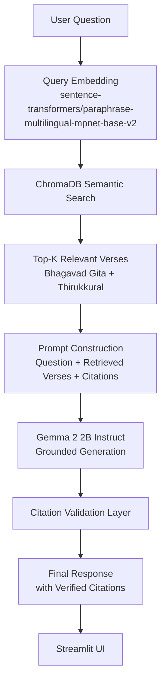

<div align="center">

# 🕉️ VerseSage

### AI-Powered Cross-Scripture Wisdom Engine

*Ask a life question. Receive grounded wisdom — cited, compared, and drawn directly from India's scriptural traditions.*

[](https://www.python.org/)
[](https://streamlit.io/)
[](https://ai.google.dev/gemma)
[](https://www.trychroma.com/)
[](#license)
[](#)

</div>

---

> **Current Scope:** VerseSage currently supports the **Bhagavad Gita** and **Thirukkural**. Additional scriptures are planned as future work — see [Future Scope](#-future-scope).

---

## 🌸 Hero Section

**VerseSage** is an AI-powered Cross-Scripture Wisdom Engine built on **Google's Gemma 2 2B Instruct** model and **Retrieval-Augmented Generation (RAG)**. It answers natural-language life questions by retrieving relevant verses from Indian scriptures and generating grounded, comparative responses — with every claim traceable back to its source verse.

Rather than a generic chatbot reciting facts about scripture, VerseSage retrieves the actual verses relevant to a question and lets Gemma reason *across* traditions — showing how the Bhagavad Gita and Thirukkural each approach the same idea, always cited.

---

## ❓ Problem Statement

India's philosophical and scriptural texts contain centuries of accumulated wisdom on nearly every human dilemma — duty, detachment, grief, ambition, integrity. But this wisdom is:

- **Scattered** across untranslated or inconsistently translated sources
- **Siloed** — a person exploring the Gita rarely also encounters the Thirukkural's take on the same question, despite the deep resonance between Indian traditions
- **Hard to search meaningfully** — keyword search fails when a person doesn't know the exact terminology (e.g., *dharma*, *aram*) used in the original text

There is no accessible, trustworthy tool that lets someone ask a plain-language question and receive an answer grounded in *actual verses*, compared *across* traditions, without hallucinated or fabricated scripture.

---

## 💡 Solution Overview

VerseSage combines semantic retrieval with grounded generation:

1. A user asks a question in natural language (e.g., *"How should I handle failure?"*)
2. The system retrieves the most semantically relevant verses from the Bhagavad Gita and Thirukkural using vector embeddings
3. Gemma 2 2B Instruct generates a response **strictly grounded in the retrieved verses** — no external knowledge, no fabrication
4. Every claim in the response is validated against its cited verse before being shown to the user

The result: an answer that reads like a knowledgeable guide, but is fully traceable and verifiable against real scriptural text.

---

## ✨ Key Features

| Feature | Description |
|---|---|
| 🗣️ **Natural Language Questioning** | Ask life questions in plain English — no need to know scriptural terminology |
| 🔍 **Retrieval-Augmented Generation** | Answers are grounded in retrieved passages, not model memory alone |
| ⚖️ **Cross-Scripture Comparison** | See how the Bhagavad Gita and Thirukkural each address the same theme |
| 📖 **Citation Validation** | Every generated claim is checked against its source verse |
| 🧠 **Semantic Retrieval via ChromaDB** | Finds conceptually relevant verses, not just keyword matches |
| 🖥️ **Streamlit Interface** | Simple, accessible web interface for querying the engine |
| 🔒 **Grounded-Only Responses** | The model is constrained to reason only over retrieved passages |

> ℹ️ **Note:** All features listed above are implemented in the current build. No feature on this list is aspirational.

---

## 🏗️ Architecture Overview



---

## 🔄 Project Workflow

1. **Data Preparation** — Scripture texts (Bhagavad Gita, Thirukkural) are cleaned and structured at verse level, preserving chapter/verse metadata for citation.
2. **Embedding Generation** — Each verse is embedded using `sentence-transformers/paraphrase-multilingual-mpnet-base-v2` and stored in ChromaDB alongside its metadata.
3. **Query Time — Retrieval** — When a user submits a question, it is embedded using the same model and matched against the verse embeddings in ChromaDB to retrieve the most relevant passages.
4. **Prompt Construction** — Retrieved verses (with their citations) are assembled into a structured prompt for Gemma.
5. **Grounded Generation** — Gemma 2 2B Instruct generates a response constrained to reasoning over the retrieved verses only.
6. **Citation Validation** — The generated response is checked to confirm that cited verses actually support the claims made.
7. **Display** — The final, validated, cited response is rendered in the Streamlit interface.

---

## 🛠️ Technology Stack

| Layer | Technology |
|---|---|
| Language | Python |
| Interface | Streamlit |
| Core LLM | Google Gemma 2 2B Instruct |
| Model Access | KaggleHub |
| Deep Learning Framework | PyTorch |
| Embeddings | Hugging Face Transformers, Sentence Transformers |
| Embedding Model | `sentence-transformers/paraphrase-multilingual-mpnet-base-v2` |
| Vector Database | ChromaDB |
| Retrieval Method | Retrieval-Augmented Generation (RAG) |

---

## 📁 Folder Structure

<details>
<summary>Click to expand project structure</summary>

```
verse-sage/
│
├── app.py                      # Streamlit entry point
├── requirements.txt
├── README.md
├── .gitignore
│
├── data/
│   ├── bhagavad_gita.json      # Verse-level Bhagavad Gita data
│   └── thirukkural.json        # Verse-level Thirukkural data
│
├── embeddings/
│   └── create_embeddings.py    # Embedding generation script
│
├── vectordb/
│   ├── retrieve.py             # Semantic retrieval logic
│   └── chroma_store/           # Persisted ChromaDB collection
│
├── llm/
│   ├── gemma_client.py         # Gemma model interface
│   ├── prompt_builder.py       # Prompt construction
│   ├── citation_validator.py   # Citation validation logic
│   └── response_generator.py   # End-to-end response generation
│
├── pipeline/
│   └── rag_pipeline.py         # Full RAG pipeline orchestration
│
└── docs/
    ├── Technical_Brief.docx
    ├── Final_Architecture.docx
    ├── Project_Presentation.pptx
    └── Demo_Script.md
```

</details>

---

## ⚙️ Installation Guide

<details>
<summary>Click to expand installation steps</summary>

**1. Clone the repository**
```bash
git clone https://github.com/roshanisingh16/verse-sage.git
cd verse-sage
```

**2. Create and activate a virtual environment**
```bash
python -m venv venv
# Windows
venv\Scripts\activate
# macOS/Linux
source venv/bin/activate
```

**3. Install dependencies**
```bash
pip install -r requirements.txt
```

**4. Build the embeddings and vector database**
```bash
python embeddings/create_embeddings.py
```

</details>

---

## ▶️ Running the Project

```bash
streamlit run app.py
```

The application will launch in your default browser. Enter a life question in the input box to receive a grounded, cited response.

---

## 💬 Example Usage

**Input:**
> "How should I deal with failure?"

**Output (illustrative format):**
> According to the **Bhagavad Gita (2.47)**, one is entitled to perform their duty but not to the fruits of their actions — suggesting failure should not deter right action.
>
> The **Thirukkural** similarly emphasizes steady effort over attachment to outcome.
>
> *Citations verified against retrieved source verses.*

> ⚠️ The exact wording of responses depends on live model generation and retrieval results; the above is illustrative of the response format, not a fixed output.

---

## 🔬 RAG Pipeline Explanation

VerseSage's RAG pipeline ensures that Gemma's responses are **grounded**, not hallucinated:

1. **Embedding-based retrieval** ensures semantic relevance rather than keyword matching, so a question about "letting go" can retrieve verses about *detachment* even without using that exact word.
2. **Constrained prompting** explicitly instructs Gemma to reason only over the retrieved verses provided in context, not general knowledge.
3. **Structured citations** are attached to every retrieved verse and passed through to the generation step, so the model has direct access to verse references while writing its response.

This design minimizes hallucination risk and keeps every generated claim traceable to an actual scriptural source.

---

## ✅ Citation Validation

After Gemma generates a response, a **citation validation layer** checks that:

- Every citation referenced in the output corresponds to a verse that was actually retrieved
- The cited verse content plausibly supports the claim attributed to it

This step exists specifically to catch and prevent fabricated or mismatched citations before a response reaches the user.

---

## 🚀 Future Scope

- 📚 Add support for additional Indian scriptures (Upanishads, Dhammapada, Guru Granth Sahib, Ramayana, and others)
- 🌐 Improved multilingual support for queries and responses
- 🎙️ Voice-based interaction
- 📱 Mobile interface
- 🔎 More advanced retrieval strategies (hybrid search, reranking)
- 🛡️ Improved citation verification robustness

---

## 👥 Team Members

| Name | Role |
|---|---|
| _[Name Placeholder]_ | _[Role Placeholder]_ |
| _[Name Placeholder]_ | _[Role Placeholder]_ |
| _[Name Placeholder]_ | _[Role Placeholder]_ |

---

## 🖼️ Screenshots

<details>
<summary>Click to expand screenshots</summary>

> _[Screenshot placeholder — Home / Query Interface]_

> _[Screenshot placeholder — Example Response with Citations]_

> _[Screenshot placeholder — Comparative View]_

</details>

---

## 🌟 Why VerseSage?

Most AI tools built over religious or philosophical texts function as simple chatbots — answering from a single source, often without verifiable grounding. VerseSage is different in two ways:

1. **It's grounded, not generative-only.** Every response is built from retrieved, citable verses — not the model's unconstrained memory.
2. **It compares, not just retrieves.** By working across two distinct traditions (Bhagavad Gita and Thirukkural), VerseSage surfaces how independently-developed philosophies converge or diverge on the same human questions — a task that requires genuine reasoning, not lookup.

---

## 🧗 Challenges Faced

- Sourcing scripture data with consistent, citable verse-level structure across different traditions
- Ensuring Gemma's responses stayed grounded in retrieved content rather than drifting into general knowledge
- Building a reliable citation validation step to catch mismatched or unsupported claims
- Balancing retrieval quality with response latency in a resource-constrained hackathon environment

---

## 📘 Learnings

- The quality of a RAG system depends heavily on the granularity and consistency of source data structuring
- Grounding and citation validation are non-trivial — constraining an LLM to *only* retrieved context requires careful prompt design
- Cross-tradition comparison is a meaningfully harder retrieval and reasoning task than single-source Q&A, but yields far more insightful output

---

## 🙏 Acknowledgements

- Text sources for the Bhagavad Gita and Thirukkural datasets
- Google's Gemma model family
- The open-source ChromaDB, Sentence Transformers, and Hugging Face communities

---

## 📄 License

This project is licensed under the [MIT License](LICENSE).

---

<div align="center">

*Built with 🕉️ for a national AI hackathon.*

</div>
